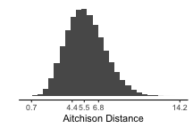

```{r setup}
# In order to use these packages, we also need to install Cairo.
library(tidyverse)
library(tidymodels)
library(plotly)
library(heatmaply)
library(protoclust)
library(spotifyr)
library(compmus)
source('spotify.R')
```

### What kind of portfolio do I need to create?

Your portfolio will be a 5–10-page dashboard in the style of the R package [flexdashboard](https://rmarkdown.rstudio.com/flexdashboard/using.html#storyboards), using data from the [Spotify API](https://developer.spotify.com). Your dashboard should cover the following topics, but note that it is possible (and often desirable) for a single visualisation or tab to cover more than one topic.

  - **Background**: Which tracks did you choose? Why? What questions will the dashboard answer?
  - **Track-level features**: What insights into your corpus can be drawn from Spotify’s track-level features (valence, danceability, etc.)?
  - **Chroma features** [pitch]: What insights into your corpus can be drawn from Spotify’s chroma features?
  - **Loudness** [volume]: What insights into your corpus can be drawn from Spotify’s ‘loudness’ (power) features, either at the track level or the section level?
  - **Timbre features** [timbre]: What insights into your corpus can be drawn from Spotify’s timbre features?
  - **Temporal features** [duration]: What is notable, effective, or ineffective about structural segments, metre, rhythm, or beats in your corpus, as derived from Spotify features?
  - **Classification/regression**: Where explicit labels in your corpus exist, how strong are Spotify features for classification or regression?
  - **Clustering**: Where explicit labels in your corpus are lacking, which Spotify features generate potentially meaningful clusters?
  - **Contribution**: What have you learned from this set of analyses? Who could these conclusions benefit, and how?

Depending on your topic, you may want to start with a text-based opening like this one; alternatively, you could put your most compelling visualisation directly on the first tab and just use the commentary to introduce your corpus and research questions.

This storyboard contains further examples from each week to inspire you. For more detailed code examples from each week, check the [repository page](https://github.com/jaburgoyne/compmus2020) or use the following links for rendered R Markdown files.

- [Week 8](compmus2020-w08.nb.html)
- [Week 9](compmus2020-w09.nb.html)
- [Week 10](compmus2020-w10.nb.html)
- [Week 11](compmus2020-w11.nb.html)
- [Week 12](compmus2020-w12.nb.html)

***

The grading breakdown for the portfolio is as follows. The rubric was adapted from the Association of American Colleges and Universities (AAC&U) Inquiry and Analysis and Quantitative Literacy [VALUE rubrics](https://www.aacu.org/value-rubrics).

| Component        | Points |
|------------------|:------:|
| Corpus selection |      7 |
| Assumptions      |      7 |
| Representation   |      7 |
| Interpretation   |      7 |
| Analysis         |      7 |
| Presentation     |      7 |

### The Grammys are angrier than the Edisons

```{r grammys}
grammy <- get_playlist_audio_features('digster.fm', '4kQovkgBZTd8h2HCM3fF31')
edison <- get_playlist_audio_features('spotify', '37i9dQZF1DX8mnKbIkppDf')
awards <-
    grammy %>% mutate(playlist = "Grammys") %>%
    bind_rows(edison %>% mutate(playlist = "Edisons"))
angry <-
    awards %>%                   # Start with awards.
    mutate(                      # Make pretty labels for mode.
        mode =                  
            factor(
                mode, 
                c(1, 0), 
                c("Major", "Minor")
            )
    ) %>% 
    ggplot(                      # Set up the plot.
        aes(
            x = valence,
            y = energy,
            size = loudness,
            colour = mode,
            label = track.name   # Labels will be interactively visible.
        )
    ) +
    geom_point() +               # Scatter plot.
    geom_rug(size = 0.1) +       # Add 'fringes' to show data distribution.
    facet_wrap(~ playlist) +     # Separate charts per playlist.
    scale_x_continuous(          # Fine-tune the x axis.
        limits = c(0, 1),
        breaks = c(0, 0.50, 1),  # Use grid-lines for quadrants only.
        minor_breaks = NULL      # Remove 'minor' grid-lines.
    ) +
    scale_y_continuous(          # Fine-tune the y axis in the same way.
        limits = c(0, 1),
        breaks = c(0, 0.50, 1),
        minor_breaks = NULL
    ) +
    scale_colour_brewer(         # Use the Color Brewer to choose a palette.
        type = "qual",           # Qualitative set.
        palette = "Paired"       # Name of the palette is 'Paired'.
    ) +
    scale_size_continuous(       # Fine-tune the sizes of each point.
        trans = "exp",           # Use an exp transformation to emphasise loud.
        guide = "none"           # Remove the legend for size.
    ) +
    theme_light() +              # Use a simpler them.
    labs(                        # Make the titles nice.
        x = "Valence",
        y = "Energy",
        colour = "Mode"
    )

ggplotly(angry)
```

***

For this visualisation from Week 7, I took playlists of the pop music presented at the Grammy awards (US) and the Edison awards (NL) in 2019. Using `ggplotly`, the visualisation became interactive.

The *x* axis shows valence and the *y* axis shows Spotify's ‘energy’ feature, which is roughly analogous to the notion of arousal in psychological research on emotion. Under this model, the quadrants of each graph, starting clockwise from the top left, represent angry, happy, relaxed, and sad music. The size of each point is proportional to the average volume of the track.

The visualisation shows that in 2019, the pop music at the Grammys was (according to Spotify) rather angrier and rather louder than the music at the Edisons.

### Bonus Tab: Do the Dutch really listen to happier music?

```{r happy}
top_50_nl <- get_playlist_audio_features('spotify', '37i9dQZEVXbKCF6dqVpDkS')
top_50_be <- get_playlist_audio_features('spotify', '37i9dQZEVXbJNSeeHswcKB')
top_50_world <- get_playlist_audio_features('spotify', '37i9dQZEVXbMDoHDwVN2tF')
top_50s <-
    top_50_nl %>% mutate(country = 'The Netherlands') %>%
    bind_rows(top_50_be %>% mutate(country = 'Belgium')) %>% 
    bind_rows(top_50_world %>% mutate(country = 'Global')) %>% 
    mutate(
      country = fct_relevel(country, 'Global', 'The Netherlands', 'Belgium')
    )
february_dip <- 
    top_50s %>% 
    ggplot(                      # Set up the plot.
        aes(
            x = valence,
            y = energy,
            size = track.popularity,
            colour = danceability,
            label = track.name   # Labels will be interactively visible.
        )
    ) +
    geom_point() +               # Scatter plot.
    geom_rug(size = 0.1) +       # Add 'fringes' to show data distribution.
    facet_wrap(~ country) +      # Separate charts per country.
    scale_x_continuous(          # Fine-tune the x axis.
        limits = c(0, 1),
        breaks = c(0, 0.50, 1),  # Use grid-lines for quadrants only.
        minor_breaks = NULL      # Remove 'minor' grid-lines.
    ) +
    scale_y_continuous(          # Fine-tune the y axis in the same way.
        limits = c(0, 1),
        breaks = c(0, 0.50, 1),
        minor_breaks = NULL
    ) +
    scale_colour_viridis_c(      # Use the cividis palette
       option = "E",             # Qualitative set.
       alpha = 0.8,              # Include some transparency
       guide = 'none'
    ) +
    scale_size_continuous(       # Fine-tune the sizes of each point.
        guide = "none"           # Remove the legend for size.
    ) +
    theme_light() +              # Use a simpler them.
    labs(                        # Make the titles nice.
        x = "Valence",
        y = "Energy"
    )

ggplotly(february_dip)
```

***

In March 2019, [The Economist](https://www.economist.com/graphic-detail/2020/02/08/data-from-spotify-suggest-that-listeners-are-gloomiest-in-february?fsrc=scn/fb/te/bl/ed/sadsongssaysomuchdatafromspotifysuggestthatlistenersaregloomiestinfebruarygraphicdetail) published a graphic showing a worldwide dip in the emotional valence of the music to people people listen around February each year. The graphic also broke down the emotional valence for every month of the year for a selection of Spotify markets, and it revealed quite a surprise: although overall, there seemed to be two large groups, with Latin America and Spain listening to more positively valenced music than most of the rest of the world, the Netherlands stood on its own somewhere in between these two extremes. This graphic compares Spotify Top 50 in the Netherlands against Belgium, a more typical neighbouring country, as well as the worldwide average, on the standard valence--arousal model. More popular songs (worldwide) have larger dots; more danceable songs are yellow.

### The Tallis Scholars sing Josquin more slowly than La Chapelle Royale -- except for one part [chroma features].

```{r tallis}
tallis <- 
    get_tidy_audio_analysis('2J3Mmybwue0jyQ0UVMYurH') %>% 
    select(segments) %>% unnest(segments) %>% 
    select(start, duration, pitches)
chapelle <- 
    get_tidy_audio_analysis('4ccw2IcnFt1Jv9LqQCOYDi') %>% 
    select(segments) %>% unnest(segments) %>% 
    select(start, duration, pitches)
maria_dist <- 
    compmus_long_distance(
    tallis %>% mutate(pitches = map(pitches, compmus_normalise, 'manhattan')),
    chapelle %>% mutate(pitches = map(pitches, compmus_normalise, 'manhattan')),
    feature = pitches,
    method = 'aitchison')
```

```{r tallis-plot}
maria <- 
    maria_dist %>% 
    mutate(
        tallis = xstart + xduration / 2, 
        chapelle = ystart + yduration / 2) %>% 
    ggplot(
        aes(
            x = tallis,
            y = chapelle,
            fill = d)) + 
    geom_tile(aes(width = xduration, height = yduration)) +
    coord_fixed() +
    scale_x_continuous(
        breaks = c(0, 60, 105, 150, 185, 220, 280, 327), 
        labels = 
            c(
                'Ave Maria',
                'Ave cujus conceptio',
                'Ave cujus nativitas',
                'Ave pia humilitas',
                'Ave vera virginitas',
                'Ave preclara omnibus',
                'O Mater Dei',
                ''),
        ) +
    scale_y_continuous(
        breaks = c(0, 45,  80, 120, 145, 185, 240, 287), 
        labels = 
            c(
                'Ave Maria',
                'Ave cujus conceptio',
                'Ave cujus nativitas',
                'Ave pia humilitas',
                'Ave vera virginitas',
                'Ave preclara omnibus',
                'O Mater Dei',
                ''),
        ) +
    scale_fill_viridis_c(option = 'E', guide = "none") +
    theme_classic() + 
    theme(axis.text.x = element_text(angle = 30, hjust = 1)) +
    labs(x = 'The Tallis Scholars', y = 'La Chapelle Royale')
maria
```

***

This visualisation of two performances of the famous ‘Ave Maria’ setting of Josquin des Prez uses the Aitchison distance between chroma features to show how the two performances align with one another. 

For the first four stanzas, the relationship between the performances is consistent: the Tallis Scholars sing the piece somewhat more slowly than La Chapelle Royale. For the fifth stanza (*Ave vera virginitas*, starting about 3:05 into the Tallis Scholars’ performance and 2:25 into La Chapelle Royale’s), the Tallis Scholars singing faster than La Chapelle Royale, but at the beginning of the sixth stanza (*Ave preclara omnibus*, starting about 3:40 into the the Tallis Scholars’ performance and 3:05 into La Chapelle Royale’s) the Tallis Scholars return to their regular tempo relationship with La Chapelle.

Although the interactive mouse-overs from `ggplotly` are very helpful for understanding heat maps, they are very computationally intensive. Chromagrams and similarity matrices are often better as static images, like the visualisation at left.

Static images can sometimes also be useful to add content to your commentary, like the histogram of Aitchison distances below, labelled with the minimum, first quartile, median, third quartile, and maximum values in the data. You must save the images manually, however, and make sure to export them at a good size.

```{r tallis-hist}
maria_hist <- 
    maria_dist %>% 
    ggplot(aes(x = d)) +
    geom_histogram(binwidth = 0.5) +
    theme_classic() + 
    theme(
        axis.line.y = element_blank(), 
        axis.ticks.y = element_blank(),
        axis.text.y = element_blank()) +
    scale_x_continuous(breaks = c(0.7, 4.4, 5.5, 6.8, 14.2)) +
    labs(x = 'Aitchison Distance', y = '')
ggsave("compmus-w08vizb.png", maria_hist, width = 3, height = 2, dpi = 'screen')
```



### What is the structure of ‘Blood, Sweat, and Tears’ [chroma and timbre features]

```{r hazes}
bzt <- 
    get_tidy_audio_analysis('5ZLkc5RY1NM4FtGWEd6HOE') %>% 
    compmus_align(bars, segments) %>% 
    select(bars) %>% unnest(bars) %>% 
    mutate(
        pitches = 
            map(segments, 
                compmus_summarise, pitches, 
                method = 'acentre', norm = 'manhattan')) %>% 
    mutate(
        timbre = 
            map(segments, 
                compmus_summarise, timbre, 
                method = 'mean'))
bztplot <- 
    bind_rows(
        bzt %>% compmus_self_similarity(pitches, 'aitchison') %>% mutate(d = d / max(d), type = "Chroma"),
        bzt %>% compmus_self_similarity(timbre, 'euclidean') %>% mutate(d = d / max(d), type = "Timbre")) %>% 
    ggplot(
        aes(
            x = xstart + xduration / 2, 
            width = xduration,
            y = ystart + yduration / 2,
            height = yduration,
            fill = d)) + 
    geom_tile() +
    coord_fixed() +
    facet_wrap(~ type) +
    scale_fill_viridis_c(option = 'E', guide = 'none') +
    theme_classic() +
    labs(x = '', y = '')
ggplotly(bztplot)
```

***

The two self-similarity matrices at the right, each summarised at the bar level but with axes in seconds, illustrate pitch- and timbre-based self-similarity within Andre Hazes's famous ‘Bloed, Zweet en Tranen’ (2002). Both are necessary to understand the structure of the song. The chroma-based matrix picks up the five presentations of the chorus very clearly but mostly misses the poignant changes in texture during the three verses. These changes are very visible in the timbre-based matrix, especially the third verse. The timbre-based matrix also illustrates the unbalanced song structure, climaxing about halfway through and thereafter simply repeating the chorus until the fade-out. The closing guitar solo is faintly visible in the top-right corner.

### Truck-driver modulations in the Year 2525 [tonal analysis]

```{r twenty-five}
circshift <- function(v, n) {if (n == 0) v else c(tail(v, n), head(v, -n))}
                                    
major_key <- 
    c(6.35, 2.23, 3.48, 2.33, 4.38, 4.09, 2.52, 5.19, 2.39, 3.66, 2.29, 2.88)
minor_key <-
    c(6.33, 2.68, 3.52, 5.38, 2.60, 3.53, 2.54, 4.75, 3.98, 2.69, 3.34, 3.17)

key_templates <-
    tribble(
        ~name    , ~template,
        'Gb:maj', circshift(major_key,  6),
        'Bb:min', circshift(minor_key, 10),
        'Db:maj', circshift(major_key,  1),
        'F:min' , circshift(minor_key,  5),
        'Ab:maj', circshift(major_key,  8),
        'C:min' , circshift(minor_key,  0),
        'Eb:maj', circshift(major_key,  3),
        'G:min' , circshift(minor_key,  7),
        'Bb:maj', circshift(major_key, 10),
        'D:min' , circshift(minor_key,  2),
        'F:maj' , circshift(major_key,  5),
        'A:min' , circshift(minor_key,  9),
        'C:maj' , circshift(major_key,  0),
        'E:min' , circshift(minor_key,  4),
        'G:maj' , circshift(major_key,  7),
        'B:min' , circshift(minor_key, 11),
        'D:maj' , circshift(major_key,  2),
        'F#:min', circshift(minor_key,  6),
        'A:maj' , circshift(major_key,  9),
        'C#:min', circshift(minor_key,  1),
        'E:maj' , circshift(major_key,  4),
        'G#:min', circshift(minor_key,  8),
        'B:maj' , circshift(major_key, 11),
        'D#:min', circshift(minor_key,  3))

twenty_five <- 
    get_tidy_audio_analysis('5UVsbUV0Kh033cqsZ5sLQi') %>% 
    compmus_align(sections, segments) %>% 
    select(sections) %>% unnest(sections) %>% 
    mutate(
        pitches = 
            map(segments, 
                compmus_summarise, pitches, 
                method = 'acentre', norm = 'manhattan')) %>% 
    compmus_match_pitch_template(key_templates, 'aitchison', 'manhattan') %>% 
    ggplot(
        aes(x = start + duration / 2, width = duration, y = name, fill = d)) +
    geom_tile() +
    scale_fill_viridis_c(option = 'E') +
    theme_minimal() +
    labs(x = 'Time (s)', y = '', fill = 'Distance')
#ggplotly(twenty_five)
twenty_five
```

***
    
The keygram at the left shows the two modulations in Zager and Evans's 'In the Year 2525' (1969). The piece is segmented according to Spotify's estimates, and the distances represented are Aitchison distances from Spotify's chroma vectors to the original Krumhansl--Kessler key profiles (1990). 

The piece does not follow common-era tonal conventions, and the key estimates are blurry. The move from G$\sharp$ minor to A minor about a minute and a half into the song is correctly estimated, despite the high spillage into related keys. The second modulation, to B$\flat$ minor, is misunderstood as F minor. The sparser texture two-and-a-half minutes into the song throws off the key-finding algorithm seriously.

### Classifying independent workouts

```{r}
pop <- 
    get_playlist_audio_features('spotify', '37i9dQZF1DWWEcRhUVtL8n') %>% 
    add_audio_analysis
party <- 
    get_playlist_audio_features('spotify', '37i9dQZF1DWTujiC7wfofZ') %>% 
    add_audio_analysis
workout <- 
    get_playlist_audio_features('spotify', '37i9dQZF1DXaRL7xbcDl7X') %>% 
    add_audio_analysis
indie <- 
    pop %>% mutate(playlist = "Indie Pop") %>% 
    bind_rows(
        party %>% mutate(playlist = "Indie Party"),
        workout %>% mutate(playlist = "Indie Workout")) %>% 
    mutate(playlist = factor(playlist)) %>% 
    mutate(
        segments = 
            map2(segments, key, compmus_c_transpose)) %>% 
    mutate(
        pitches = 
            map(segments, 
                compmus_summarise, pitches, 
                method = 'mean', norm = 'manhattan'),
        timbre =
            map(
                segments,
                compmus_summarise, timbre,
                method = 'mean')) %>% 
    mutate(pitches = map(pitches, compmus_normalise, 'clr')) %>% 
    mutate_at(vars(pitches, timbre), map, bind_rows) %>% 
    unnest(cols = c(pitches, timbre))
indie_juice <- 
    recipe(playlist ~
               danceability +
               energy +
               loudness +
               speechiness +
               acousticness +
               instrumentalness +
               liveness +
               valence +
               tempo +
               duration +
               C + `C#|Db` + D + `D#|Eb` +
               E + `F` + `F#|Gb` + G +
               `G#|Ab` + A + `A#|Bb` + B +
               c01 + c02 + c03 + c04 + c05 + c06 +
               c07 + c08 + c09 + c10 + c11 + c12,
           data = indie) %>% 
    step_center(all_predictors()) %>%
    step_scale(all_predictors()) %>%
    # step_range(all_predictors()) %>% 
    prep(indie) %>% 
    juice
indie_cv <- indie_juice %>% vfold_cv(10)
indie_knn <- 
  nearest_neighbor(mode = 'classification', neighbors = 1) %>% 
  set_engine('kknn')
predict_knn_reduced <- function(split) {
    fit(
        indie_knn, 
        playlist ~ c01 + c02 + energy + danceability + tempo, 
        data = analysis(split)) %>% 
    predict(assessment(split), type = 'class') %>%
    bind_cols(assessment(split))
}
indie_cv %>% 
    mutate(pred = map(splits, predict_knn_reduced)) %>% unnest(pred) %>% 
    conf_mat(truth = playlist, estimate = .pred_class) %>% 
    autoplot(type = 'mosaic')
```

***

The mosaic at the left shows the performance of a classifier trying to distinguish three Spotify playlists: Indie Pop, Indie Party, and Indie Workout. Using a random-forest classifier, the most important features for classifying tracks among these playlists are:

  - Timbre Component 1 (loudness),
  - Timbre Component 2 (brightness),
  - energy,
  - danceability, and
  - tempo.
  
After these five features, there is a substantial drop in importance. The mosaic displays the results, after 10-fold cross-validation, of a nearest-neighbour classifier with just these five features. 

The performance of the classifier is mediocre: overall classification accuracy is 57 percent, with a J-index of 0.32. Although these features are reasonably effective at identifying the party and pop playlists, the precision of the classifier's predictions of workout tracks is very low: when the classifier predicts that a track is a workout track, it is actually slightly more likely to be a party track. 

Either Spotify's Indie Workout playlist is not as tailored to workouts as its names would lead users to believe, or we need features beyond the Spotify itself to make the distinction. 

### What are the components of a Hallowe'en playlist?

```{r}
halloween <- 
    get_playlist_audio_features('bnfcollection', '1vsoLSK3ArkpaIHmUaF02C') %>% 
    add_audio_analysis %>% 
    mutate(
        segments = 
            map2(segments, key, compmus_c_transpose)) %>% 
    mutate(
        pitches = 
            map(segments, 
                compmus_summarise, pitches, 
                method = 'mean', norm = 'manhattan'),
        timbre =
            map(
                segments,
                compmus_summarise, timbre,
                method = 'mean')) %>% 
    mutate(pitches = map(pitches, compmus_normalise, 'clr')) %>% 
    mutate_at(vars(pitches, timbre), map, bind_rows) %>% 
    unnest(cols = c(pitches, timbre))
halloween_juice <- 
    recipe(track.name ~
               danceability +
               energy +
               loudness +
               speechiness +
               acousticness +
               instrumentalness +
               liveness +
               valence +
               tempo +
               duration +
               C + `C#|Db` + D + `D#|Eb` +
               E + `F` + `F#|Gb` + G +
               `G#|Ab` + A + `A#|Bb` + B +
               c01 + c02 + c03 + c04 + c05 + c06 +
               c07 + c08 + c09 + c10 + c11 + c12,
           data = halloween) %>% 
    step_range(all_predictors()) %>% 
    prep(halloween %>% mutate(track.name = str_trunc(track.name, 20))) %>% 
    juice %>% 
    column_to_rownames('track.name')
tmp <- grDevices::dev.size("px")
heatmaply(
    halloween_juice,
    hclustfun = protoclust,
    dist_method = 'manhattan')
```

***

The dendrogram and heatmap at right breaks the Bibliothèque nationale de France's Hallowe'en playlist into four clusters based on Gower's distance. First, there is a small, more classical cluster, that stay strictly in their original keys with low values for C sharp, G sharp, and A sharp. Second, there is a group of danceable, high-energy tracks. The third group is difficult to characterise on the basis of the heatmap: if anything, there seems to be lower emphasis on major thirds and leading tones, perhaps pentatonic tonality. The final group clearly represents the non-instrumental, low-valence tracks on the list. 

The song titles make it clear that the over-arching them of this list has more to do with textual than musical content, however, which is not available in the Spotify API. 

